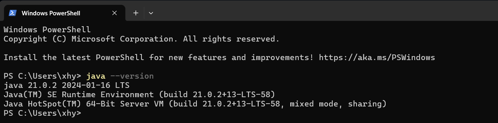

# RW-HPS Start Server

## A. Basic Configuration Requirements:

### 1. JVM Environment Requirements

- JVM: Minimum version: <font style="color:red;font-weight:bold">~~Java 8 (no longer usable due to HPS architecture upgrade)~~</font> JDK 21   
  It is highly recommended to use JDK 21, but you can also use JRE. Feel free to use whichever you prefer.

### 2. How to Get JDK?

> You need to download JDK 21:
> - 1. **Oralce JDK Direct Link** [Windows x64 Installer](https://download.oracle.com/java/21/archive/jdk-21.0.2_windows-x64_bin.exe)

# B. Windows Run Scheme:

## Run Method

Use ~~**Cmd**~~ (not recommended) or **PowerShell** (**Left Win Key + R**, and type **"powershell"**) or **Terminal (recommended)** to run the jar in your preferred directory.  
Use the command:

```bash
java -Djava.net.preferIPv4Stack=true -Dfile.encoding=UTF-8 -jar Server.jar
# TODO: If there are garbled characters or execution failures, use the command below.
java -jar Server.jar
```

## Common Issues in Running RW-HPS:

### Q.1.: **corroding: nativePollOnce:100,0**

</img>

#### Issue Analysis: If it gets stuck here for a long time, it means some dependencies are missing, or there is a compatibility issue due to a large version gap, thus causing this error.

</img>
#### Solution: Close the server, then delete the `data` folder as shown in the picture, and restart the server.
---

### Q.2.: **Error: A JNI error has occurred, please check your installation and try again**

</img>

#### Issue Analysis: JDK version is lower than 21.

</img>

#### Solution: Upgrade to JDK 21, refer to the JDK configuration above. When you input:

```bash
java -version
```

The correct JDK 21 setup should display the following image, indicating you have successfully upgraded to JDK 21:

</img>

### Q.3.: **Not D!!!**

</img>

#### Issue Analysis: The D parameter is not supported (possibly separated by a period), so you need to use the command:

```bash
java -D"file.encoding=UTF-8" -jar Server.jar
```

#### Solution: Use the command provided above.

### Q.4.: **java.io.IOException: Problem reading font data**

</img>

#### Issue Analysis: If you are using Linux, it means the Font dependency is missing.

#### Solution: Manually install `fontconfig`

**Centos**: ```yum install fontconfig```  
**Ubuntu**: ```apt-get install fontconfig```
---
<br>

# C. Other Platforms and Methods of Running:

## 1. Use the Precompiled Version from Our Github

1. Download the version from our [Releases](https://github.com/RW-HPS/RW-HPS/releases).

## 2. Linux Platform

**Not recommended for users with no basic knowledge**
> Note that Linux needs to stay alive, you can use Screen **refer to the end of the article**

Then directly input in the terminal:

```bash
java -Djava.net.preferIPv4Stack=true -jar Server.jar
```

## 3. Manually Compile the Latest Test Version

### If you don't know how to use Gradle, please move to

[Gradle Tutorial](Gradle.md)

1. You need to install Git, Java 11, and Screen (or you can use your preferred method to keep it alive).

### A. Centos

```bash  
sudo yum install git java11 screen -y
```

### B. Ubuntu

```bash  
sudo add-apt-repository ppa:linuxuprising/java
sudo apt update
sudo apt-get install git oracle-java11-installer screen -y  
```

2. Synchronize the repository
> According to personal preference

```bash
HTTPS  
git clone https://github.com/RW-HPS/RW-HPS.git
``` 

```bash  
SSH
git clone git@github.com:RW-HPS/RW-HPS.git  
```

3. Start compiling the latest version
Input in the command line:

```bash
./gradlew jar
```

Wait for it to finish.

4. Use  
The compiled Server Jar can be found in the `Server-All/build/libs` directory.

5. Run  
Run the jar in your preferred directory.

```bash
java -Djava.net.preferIPv4Stack=true -jar Server.jar
```

However, this will close when SSH disconnects, so we use Screen mentioned above.

## 4. Using Screen

1. Install Screen (or use your preferred method to keep it alive).      
Centos:

```bash  
sudo yum install screen -y
```

Ubuntu:

```bash  
sudo apt update
sudo apt-get install screen -y  
```

```bash
screen -S your_preferred_name
cd to_the_jar_directory
java -Djava.net.preferIPv4Stack=true -Dfile.encoding=UTF-8 -jar Server.jar

# Exit using Ctrl + A + D
# Re-enter using
screen -r your_set_name
# If you can't enter, get the id using
screen -ls
screen -r id
```
